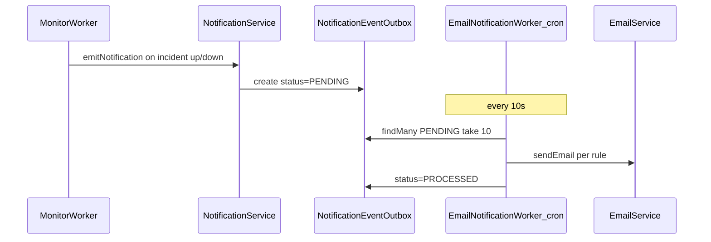
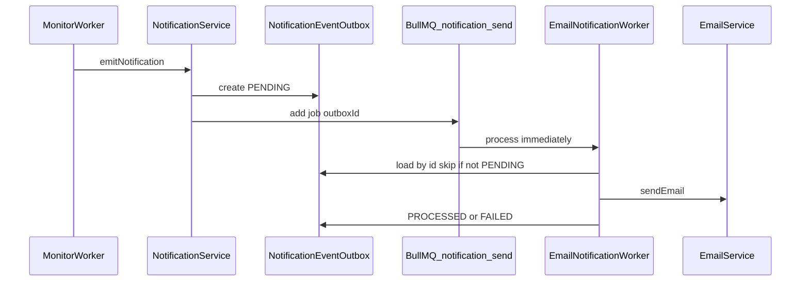
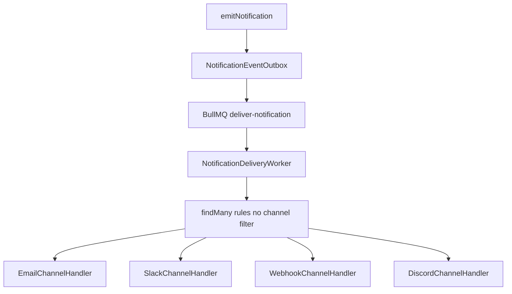

# Immediate email notifications via BullMQ

## Current flow



Incident changes already call [`emitNotification`](src/notification/notification.service.ts) from [`monitor.worker.ts`](src/monitor/monitor.worker.ts) (lines 254–298). The gap is only **how** the outbox is consumed—not **when** events are recorded.

## Target flow



---

## 1. Add a notification queue

Extend [`src/queue/queue.config.ts`](src/queue/queue.config.ts) (same Redis connection as `monitor-check`):

```typescript
export const notificationQueue = new Queue('notification-send', {
  connection: { host: 'localhost', port: 6379 },
});
```

Job payload: `{ outboxId: string }`.

Job options (recommended):

- `attempts: 3` with exponential backoff (transient SMTP/network failures)
- `removeOnComplete: true` (or keep small retention for debugging)

---

## 2. Enqueue on emit (single trigger point)

Update [`NotificationService.emitNotification`](src/notification/notification.service.ts):

1. `create` outbox row (unchanged).
2. `await notificationQueue.add('deliver-notification', { outboxId: row.id }, jobOptions)` (channel-agnostic job name).
3. Return the created row (optional; useful for tests).

No changes required in [`monitor.worker.ts`](src/monitor/monitor.worker.ts)—it already calls `emitNotification` at the right times.

Import `notificationQueue` from queue config (same pattern as [`monitor.service.ts`](src/monitor/monitor.service.ts) uses `monitorQueue`).

---

## 3. Refactor `EmailNotificationWorker` from cron to BullMQ worker

In [`email-notification.worker.ts`](src/notification/email-notification.worker.ts):

| Remove | Add |
|--------|-----|
| `@Cron('*/10 * * * * *')` + `process()` poll loop | `OnModuleInit` / `OnModuleDestroy` like [`MonitorWorker`](src/monitor/monitor.worker.ts) |
| — | `new Worker('notification-send', handler, { connection })` |

Handler:

```typescript
async (job) => {
  const { outboxId } = job.data;
  const event = await this.prisma.notificationEventOutbox.findUnique({
    where: { id: outboxId },
  });
  if (!event || event.status !== 'PENDING') return; // idempotent
  await this.handleEvent(event);
}
```

Keep `handleEvent`, `buildEmailContent`, and `escapeHtml` as-is.

**On failure:** let BullMQ retry; on final failure set outbox `status: 'FAILED'` (add handling in a `catch` or `failed` event listener) so rows do not stay `PENDING` forever.

---

## 4. Optional safety net (recommended)

Keep a **slow** cron (e.g. every 5 minutes) that finds `PENDING` rows older than 2 minutes and re-enqueues them. Covers:

- API crashed after DB write but before `queue.add`
- Redis briefly unavailable during enqueue

This is optional but cheap insurance; can live in the same worker class or a tiny `NotificationReconciliationService`.

If you skip it, document that ops must re-queue stuck rows manually.

---

## 5. Module and dependency cleanup

- [`notification.module.ts`](src/notification/notification.module.ts): no structural change beyond worker lifecycle; ensure `EmailModule` + `PrismaModule` remain available.
- [`app.module.ts`](src/app.module.ts): if cron is fully removed and no other `@Cron` exists, you may remove `ScheduleModule.forRoot()` (currently only used by this worker).

---

## 6. Outbox status semantics (small hardening)

| Status | Meaning |
|--------|---------|
| `PENDING` | Written, not yet delivered |
| `PROCESSED` | All deliveries attempted (existing; see multi-channel note below) |
| `FAILED` | Exhausted retries (new usage) |

Optional: add `PROCESSING` + conditional update to prevent double-send if you ever run multiple notification workers. With one worker and idempotent `status !== 'PENDING'` check, single-worker setup is sufficient for now.

---

## Files to change

| File | Change |
|------|--------|
| [`src/queue/queue.config.ts`](src/queue/queue.config.ts) | Add `notificationQueue` |
| [`src/notification/notification.service.ts`](src/notification/notification.service.ts) | Enqueue after outbox `create` |
| [`src/notification/email-notification.worker.ts`](src/notification/email-notification.worker.ts) | BullMQ `Worker` instead of `@Cron` |
| [`src/app.module.ts`](src/app.module.ts) | Remove `ScheduleModule` if unused |
| (optional) same worker file | Slow reconciliation cron |

---

## Testing checklist

1. Trigger monitor DOWN → outbox row `PENDING` → email within seconds (not up to 10s).
2. Trigger monitor UP → same for recovery email.
3. Confirm outbox moves to `PROCESSED` with `processedAt` set.
4. Simulate email failure → BullMQ retries → eventual `FAILED` on outbox.
5. (If reconciliation added) Stop Redis during emit, verify row is picked up by slow cron later.

---

## Why not Redis pub/sub here

You already use Redis pub/sub for SSE ([`realtime-subscriber.service.ts`](src/realtime/realtime-subscriber.service.ts)). Pub/sub is fine for ephemeral UI updates; email needs **at-least-once delivery and retries**, which BullMQ provides and matches your existing [`monitor-check`](src/queue/queue.config.ts) pattern.

---

## Multi-channel extensibility (Slack, Discord, webhooks)

**Yes — this plan supports future integrations.** The trigger layer (outbox + one BullMQ job per event) is **channel-agnostic**. Monitor worker and `emitNotification` stay unchanged when you add channels.

### What you already have

- [`NotificationEndpoint`](prisma/schema.prisma) with `channel` enum: `EMAIL`, `SLACK`, `WEBHOOK` (add `DISCORD` to the enum when needed).
- [`NotificationRule`](prisma/schema.prisma) links endpoints to events + optional `monitorId` scope.
- [`NotificationDelivery`](prisma/schema.prisma) model for per-rule delivery tracking (not used by the email worker today).
- Docs note SLACK/WEBHOOK can be stored but only EMAIL is delivered ([`docs/notification-api.md`](docs/notification-api.md)).

### What the BullMQ worker does today (email only)

[`handleEvent`](src/notification/email-notification.worker.ts) loads rules with a hard filter:

```typescript
endpoint: { channel: 'EMAIL' }
```

So the **queue and outbox are multi-channel-ready**; the **handler is email-specific**. That is fine for this PR.

### Recommended shape when adding channels



1. **One job per outbox event** (not per channel) — worker loads all matching rules for `userId` + `type` + `monitorId`.
2. **Dispatch by `rule.endpoint.channel`** — switch or registry map `EMAIL` → `EmailChannelHandler`, `SLACK` → `SlackChannelHandler`, etc.
3. **Per-channel services** — `SlackService.postMessage`, `WebhookService.postJson`, similar to `EmailService.sendEmail`.
4. **Optional: use `NotificationDelivery`** — create one row per rule attempt; mark `SENT` / `FAILED` per channel for observability and partial failure (email OK, Slack failed).
5. **Outbox `PROCESSED`** — mark when all rule deliveries finish (or when all attempts are recorded), not when only email succeeds.

### Discord specifically

Not in the Prisma enum yet. Add `DISCORD` to `NotificationChannel` + migration, endpoint `config` shape (e.g. `{ webhookUrl }`), and a handler (Discord incoming webhooks are HTTP POST, similar to generic webhook).

### What you do *not* need per channel

- Separate BullMQ queues per channel (unless volume/retry policies differ wildly).
- Changes to `emitNotification` or monitor worker for each new integration.
- Separate cron pollers per channel.

### Small naming tweak in this plan

Use job name `deliver-notification` (not `send-email`) so the queue clearly represents “process outbox event,” not “email only.”
